# DACTA — Đặc tả chi tiết hệ thống thông tin SOS Care

> Tài liệu Phân tích & Thiết kế hệ thống thông tin (Analysis & Design) theo chuẩn hướng đối tượng (UML) cho dự án **SOS Care — Hệ thống chăm sóc người cao tuổi**.
> Toàn bộ nội dung bằng tiếng Việt có dấu. Mọi sơ đồ được viết bằng cú pháp **PlantUML**, có thể render trực tiếp (PlantUML server / plugin VS Code / IntelliJ).

---

## Mục lục

1. [Mô tả hệ thống](#1-mô-tả-hệ-thống)
2. [Phân tích yêu cầu](#2-phân-tích-yêu-cầu)
3. [Sơ đồ Use Case (Use Case Diagram)](#3-sơ-đồ-use-case)
4. [Đặc tả Use Case (Use Case Specification)](#4-đặc-tả-use-case)
5. [Sơ đồ Hoạt động (Activity Diagram)](#5-sơ-đồ-hoạt-động)
6. [Sơ đồ Trình tự (Sequence Diagram)](#6-sơ-đồ-trình-tự)
7. [Sơ đồ Lớp (Class Diagram)](#7-sơ-đồ-lớp)
8. [Sơ đồ ERD (Entity Relationship Diagram)](#8-sơ-đồ-erd)
9. [Sơ đồ Trạng thái (State Diagram)](#9-sơ-đồ-trạng-thái)
10. [Sơ đồ Thành phần (Component Diagram)](#10-sơ-đồ-thành-phần)

---

## 1. Mô tả hệ thống

### 1.1 Mục tiêu hệ thống

Hệ thống **SOS Care** hỗ trợ giám sát sức khỏe, vị trí và an toàn của người cao tuổi theo thời gian thực, giúp người chăm sóc (con cái / bảo mẫu / quản trị viên) phản ứng kịp thời khi có sự cố khẩn cấp (SOS, té ngã, nhịp tim bất thường, vượt vùng an toàn).

### 1.2 Bố cục ba thành phần phân tán

| Thành phần | Công nghệ | Vai trò |
|-----------|-----------|---------|
| Ứng dụng chăm sóc (`flutter_application_1`) | Flutter >= 3.41, Dart >= 3.12 | App chính cho người chăm sóc: đăng nhập, quản lý người thân, nhận cảnh báo realtime, bản đồ, chỉ số sức khỏe, hành động từ xa |
| Backend (`sos_care_backend`) | Node.js + Express + MySQL + Sequelize + Socket.IO | REST API + realtime: tiếp nhận dữ liệu thiết bị, phát cảnh báo, xác thực JWT |
| Trình giả lập thiết bị (`sos_device_simulator`) | Flutter + Riverpod + Dio | Giả lập wearable SOS: gửi SOS, té ngã, vị trí, trạng thái thiết bị |

### 1.3 Tác nhân (Actor)

| Actor | Mô tả |
|-------|-------|
| **Người chăm sóc (Caregiver)** | Người dùng chính của app Flutter: quản lý người thân, theo dõi realtime, xử lý cảnh báo |
| **Quản trị viên (Admin)** | Tác nhân đặc biệt của Caregiver, có quyền quản trị hệ thống |
| **Người cao tuổi (Elderly)** | Đối tượng được chăm sóc, đeo thiết bị wearable (đại diện bởi trình giả lập) |
| **Thiết bị đeo (Wearable/Simulator)** | Hệ thống ngoài phát dữ liệu telemetries (SOS, vị trí, sự kiện, trạng thái) lên backend |
| **Hệ thống Backend** | Hệ thống phụ trợ xử lý nghiệp vụ, lưu DB, phát realtime |

---

## 2. Phân tích yêu cầu

### 2.1 Yêu cầu chức năng (Functional Requirements)

- **REQ-01 — Quản lý tài khoản**: đăng ký, đăng nhập (JWT), tự đăng xuất khi token hết hạn (401), lưu profile theo tài khoản, đồng bộ DB.
- **REQ-02 — Quản lý người thân**: thêm / sửa / xóa / sắp xếp lại người cao tuổi, gán thiết bị wearable, cấu hình vùng an toàn (geofence).
- **REQ-03 — Quản lý liên hệ khẩn cấp**: thêm / sửa / xóa liên hệ khẩn cấp cho từng người thân.
- **REQ-04 — Giám sát realtime**: nhận cảnh báo SOS, té ngã (FALL_DETECTED), nhịp tim/SpO2 bất thường, vị trí, trạng thái thiết bị qua Socket.IO.
- **REQ-05 — Lịch sử sự cố**: xem, lọc, xem chi tiết cảnh báo.
- **REQ-06 — Bản đồ**: xem vị trí hiện tại, vùng an toàn, bản đồ toàn màn hình (OpenStreetMap).
- **REQ-07 — Chỉ số sức khỏe**: nhịp tim, SpO2, mức pin, biểu đồ theo thời gian.
- **REQ-08 — Hành động từ xa**: gọi điện, nghe xung quanh, bật chuông, nhắn tin khẩn cấp, kích hoạt SOS từ xa.
- **REQ-09 — Cấu hình**: chế độ Sáng/Tối, ngôn ngữ vi/en, thông báo, vùng an toàn.

### 2.2 Yêu cầu phi chức năng (Non-functional Requirements)

- **NFR-01 Hiệu năng**: cảnh báo realtime truyền trong < 2 giây từ thiết bị đến app.
- **NFR-02 Khả dụng**: tự kết nối lại Socket.IO (60 lần, delay 1s).
- **NFR-03 Bảo mật**: JWT, bcryptjs hash mật khẩu, CORS giới hạn origin, HTTPS trong production, xác thực device token khi cần.
- **NFR-04 Khả năng mở rộng**: kiến trúc controller → service → repository, envelope response thống nhất.
- **NFR-05 Đa nền tảng**: Flutter chạy Android / Windows; backend Node.js độc lập nền.
- **NFR-06 Quốc tế hóa**: đa ngôn ngữ vi/en, theme Sáng/Tối.

---

## 3. Sơ đồ Use Case

> Phạm vi: ứng dụng chăm sóc + backend + trình giả lập thiết bị.

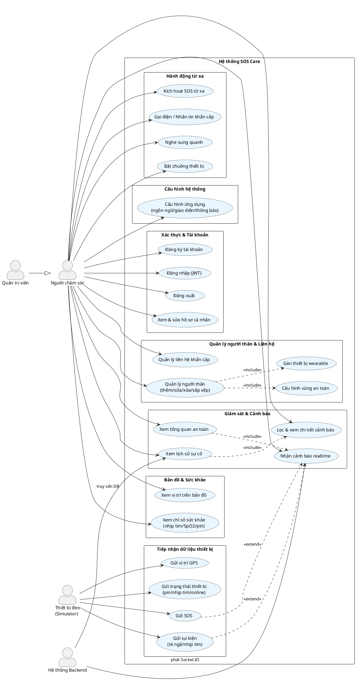

---

## 4. Đặc tả Use Case

### 4.1 Đặc tả UC-01 — Đăng nhập

| Hạng mục | Nội dung |
|----------|----------|
| **Tên Use Case** | Đăng nhập (Login) |
| **Mã** | UC-01 |
| **Tác nhân** | Người chăm sóc / Quản trị viên |
| **Mô tả** | Người dùng nhập email + mật khẩu để xác thực và nhận JWT, sau đó truy cập các chức năng của hệ thống |
| **Điều kiện trước** | Đã có tài khoản đăng ký; thiết bị có kết nối mạng |
| **Luồng sự kiện chính** | 1. Người dùng mở app → màn hình đăng nhập. 2. Nhập email, mật khẩu. 3. App gửi `POST /api/auth/login`. 4. Backend kiểm tra tài khoản + bcrypt hash. 5. Backend phát JWT. 6. App lưu JWT (shared_preferences), khởi tạo `SocketIoService` với JWT. 7. Chuyển vào màn hình chính. |
| **Luồng rẽ nhánh** | a. Sai mật khẩu → thông báo lỗi, ở lại màn đăng nhập. b. Token hết hạn (401) khi dùng app → tự đăng xuất về màn đăng nhập. c. Mất mạng → hiển thị lỗi kết nối. |
| **Điều kiện sau** | Người dùng được xác thực, realtime Socket.IO được thiết lập (join room `user:<id>`) |

### 4.2 Đặc tả UC-02 — Quản lý người thân

| Hạng mục | Nội dung |
|----------|----------|
| **Mã** | UC-02 |
| **Tác nhân** | Người chăm sóc |
| **Mô tả** | Thêm / sửa / xóa / sắp xếp lại danh sách người cao tuổi, gán thiết bị wearable, cấu hình vùng an toàn |
| **Điều kiện trước** | Đã đăng nhập |
| **Luồng chính** | 1. Vào phần quản lý người thân. 2. Chọn Thêm / Sửa / Xóa / Kéo sắp xếp. 3. Nhập thông tin (tên, tuổi, địa chỉ, thiết bị, vùng an toàn). 4. App gọi REST `relatives` API. 5. Backend lưu/đổi DB (bảng `relatives`). 6. Cập nhật `AppState`, làm mới UI. |
| **Luồng rẽ nhánh** | a. `deviceElderlyId` trùng → lỗi unique. b. Xóa người thân có cảnh báo đang hoạt động → xác nhận cascade. c. Lỗi mạng → giữ thao tác cục bộ, thử lại. |
| **Điều kiện sau** | DB và UI đồng bộ danh sách người thân |

### 4.3 Đặc tả UC-03 — Nhận cảnh báo realtime

| Hạng mục | Nội dung |
|----------|----------|
| **Mã** | UC-03 |
| **Tác nhân** | Người chăm sóc (chủ động), Thiết bị đeo (kích hoạt gián tiếp) |
| **Mô tả** | Khi thiết bị gửi SOS/sự kiện/vị trí/trạng thái, backend phát Socket.IO event, app nhận và hiển thị cảnh báo + thông báo nội bộ |
| **Điều kiện trước** | Đã đăng nhập, Socket.IO đã join room `user:<id>` |
| **Luồng chính** | 1. Thiết bị gửi `POST /api/sos` (hoặc `/api/events`, `/api/location`, `/api/device/status`). 2. Backend lưu telemetries, tạo `Alert` (denormalize `userId`). 3. Backend phát `sos:alert` / `event:fall` / `event:heart_rate` / `device:location` / `device:status` tới room `user:<id>`. 4. `DeviceEventService` nhận event → map payload (`DeviceEventMapper`) → cập nhật `AppState`. 5. `AppState` (ChangeNotifier) thông báo UI qua `AnimatedBuilder`. 6. `NotificationService` đẩy thông báo nội bộ. 7. UI hiển thị banner cảnh báo + cập nhật card người thân. |
| **Luồng rẽ nhánh** | a. Socket rớt → tự kết nối lại (forceNew + re-auth). b. Payload DECIMAL → parse kiểu nhường (không `as num?`). |
| **Điều kiện sau** | Người chăm sóc nhìn thấy cảnh báo gần như tức thời |

### 4.4 Đặc tả UC-04 — Xem lịch sử sự cố

| Hạng mục | Nội dung |
|----------|----------|
| **Mã** | UC-04 |
| **Tác nhân** | Người chăm sóc |
| **Mô tả** | Xem danh sách cảnh báo, lọc theo loại/người thân/thời gian, xem chi tiết từng cảnh báo |
| **Điều kiện trước** | Đã đăng nhập |
| **Luồng chính** | 1. Vào tab cảnh báo. 2. App gọi `GET /api/history` (JWT). 3. Backend truy vấn `alerts` + telemetries theo `userId`. 4. Hiển thị danh sách + bộ lọc. 5. Người dùng chọn mục → `GET` chi tiết. 6. Hiển thị chi tiết (loại, thời gian, vị trí, mức ưu tiên, trạng thái xác nhận). |
| **Điều kiện sau** | Người dùng nắm được diễn biến sự cố |

### 4.5 Đặc tả UC-05 — Kích hoạt SOS từ xa

| Hạng mục | Nội dung |
|----------|----------|
| **Mã** | UC-05 |
| **Tác nhân** | Người chăm sóc |
| **Mô tả** | Người chăm sóc chủ động kích hoạt cảnh báo SOS cho người thân đang đeo thiết bị |
| **Điều kiện trước** | Đã đăng nhập, có người thân đã pair thiết bị online |
| **Luồng chính** | 1. Chọn người thân → nút "Kích hoạt SOS từ xa". 2. Xác nhận dialog. 3. App gửi REST tới backend. 4. Backend tạo `Alert` urgency=critical + phát event realtime. 5. Thiết bị (simulator) nhận ack và phát chuông/hồi đáp. |
| **Điều kiện sau** | Cảnh báo SOS được ghi nhận và thiết bị phản hồi |

### 4.6 Đặc tả UC-06 — Thiết bị gửi dữ liệu telemetries

| Hạng mục | Nội dung |
|----------|----------|
| **Mã** | UC-06 |
| **Tác nhân** | Thiết bị đeo (Simulator) |
| **Mô tả** | Thiết bị gửi SOS / sự kiện / vị trí / trạng thái lên backend |
| **Điều kiện trước** | Thiết bị đã cấu hình `deviceElderlyId`, backend online |
| **Luồng chính** | 1. Người cao tuổi nhấn nút SOS hoặc sensor phát hiện té ngã/nhịp tim. 2. Simulator gửi REST tới `/api/sos`, `/api/events`, `/api/location`, `/api/device/status`. 3. Backend lưu + phát realtime. 4. Simulator nhận Socket.IO ack báo giao thành công. |
| **Luồng rẽ nhánh** | a. `useMock=true` → dùng mock data source, không cần backend. b. `DEVICE_AUTH_MODE=token` → phải gửi header `X-Device-Token`. |
| **Điều kiện sau** | Dữ liệu telemetries được lưu và lan truyền realtime |

---

## 5. Sơ đồ Hoạt động

### 5.1 Hoạt động đăng nhập & thiết lập realtime

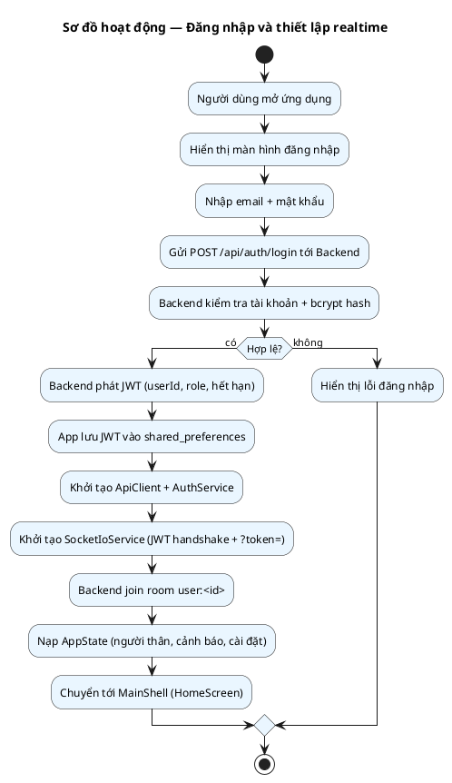

### 5.2 Hoạt động xử lý cảnh báo realtime (end-to-end)

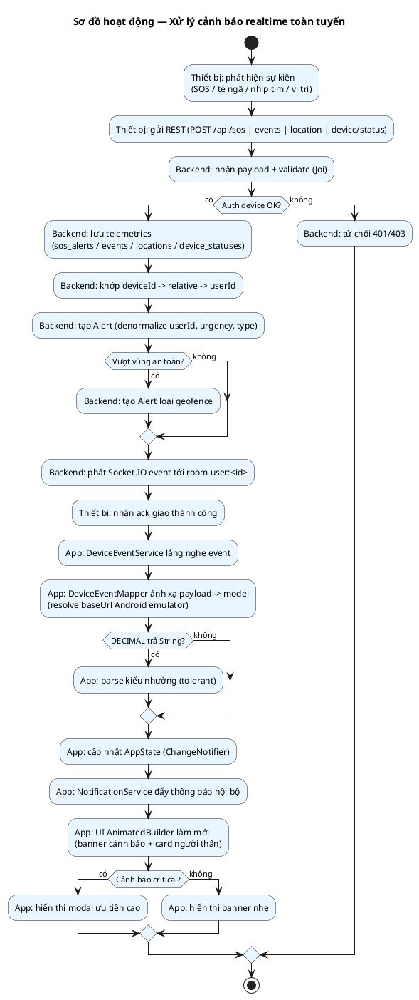

### 5.3 Hoạt động quản lý người thân

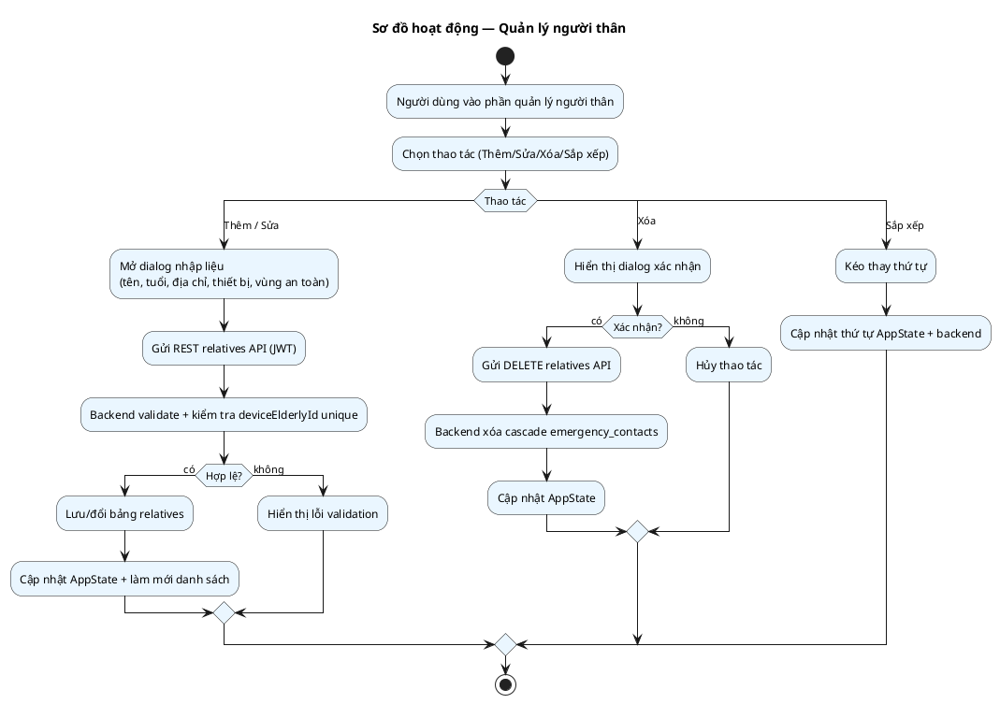

---

## 6. Sơ đồ Trình tự

### 6.1 Trình tự — Đăng nhập & thiết lập realtime

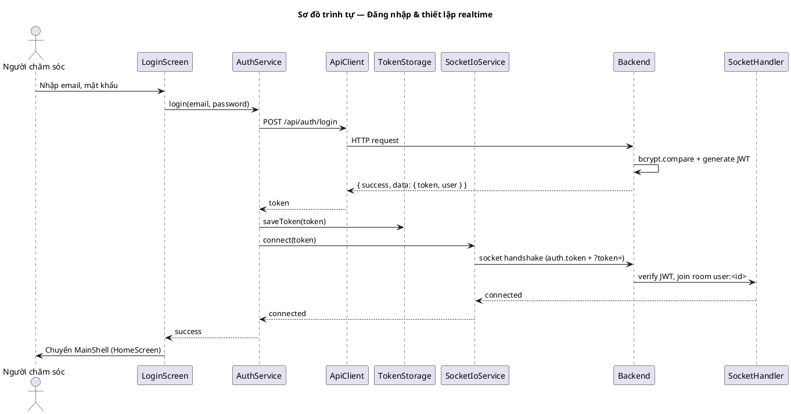

### 6.2 Trình tự — Cảnh báo SOS từ thiết bị đến app

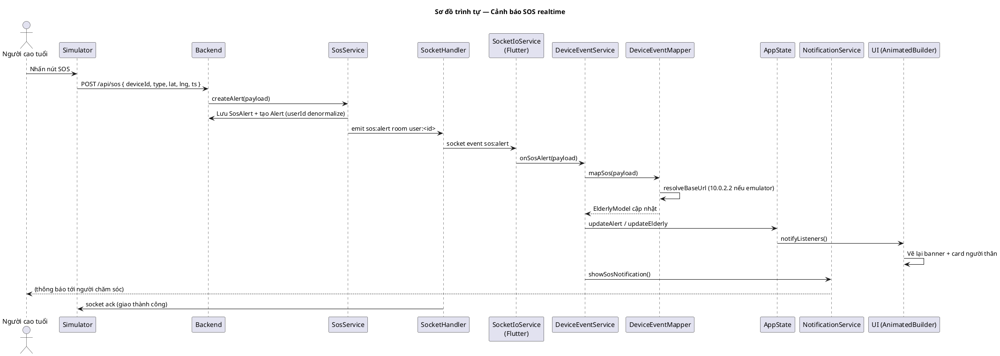

### 6.3 Trình tự — Quản lý người thân (thêm)

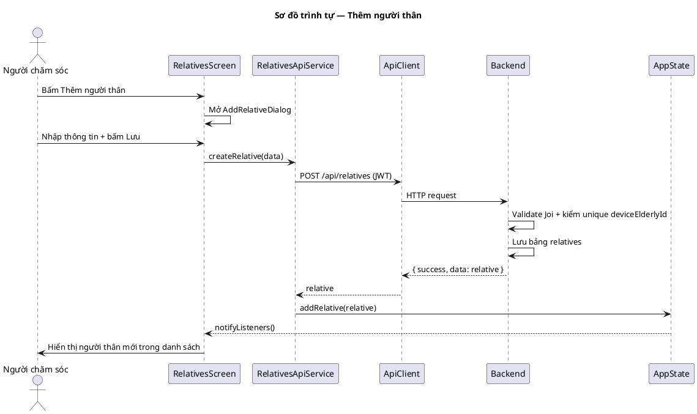

### 6.4 Trình tự — Xem lịch sử sự cố

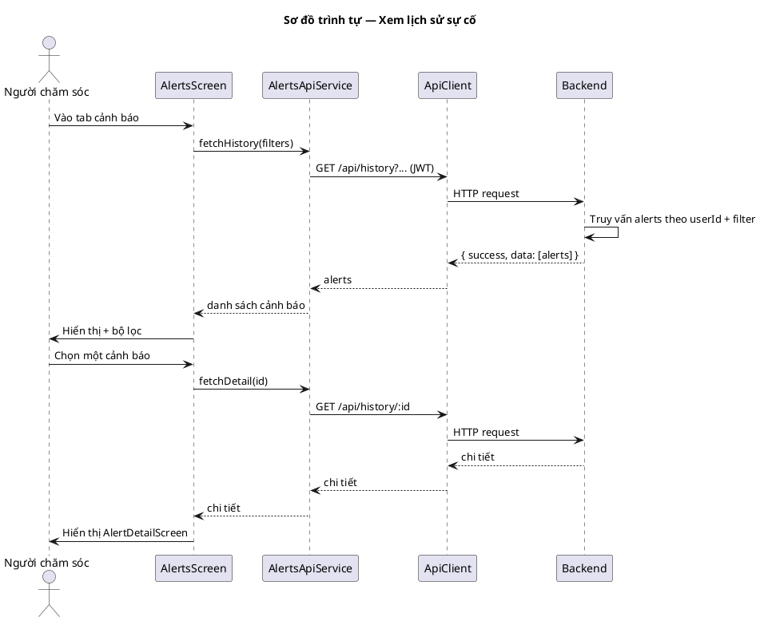

---

## 7. Sơ đồ Lớp

> Sơ đồ lớp tập trung vào lớp nghiệp vụ chính của ứng dụng Flutter và backend (chỉ lớp chính, không liệt kê toàn bộ getter/setter).

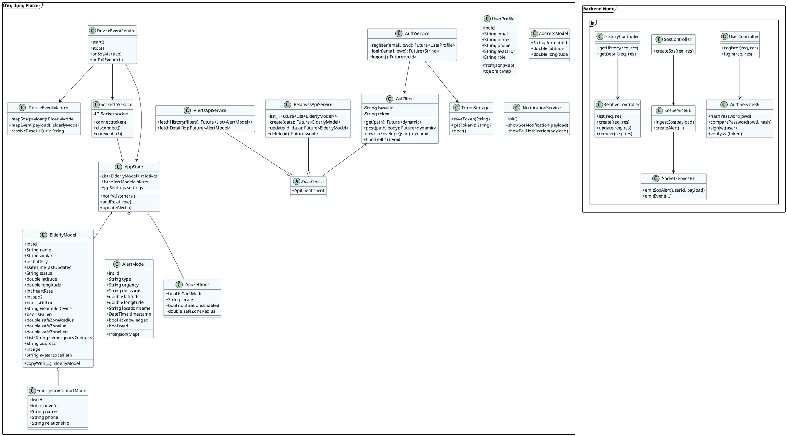

---

## 8. Sơ đồ ERD

> Sơ đồ quan hệ thực thể (Entity-Relationship) phản ánh cơ sở dữ liệu MySQL/Sequelize của backend. Ký hiệu: `PK` khóa chính, `FK` khóa ngoài, `UQ` duy nhất, `NN` không null.

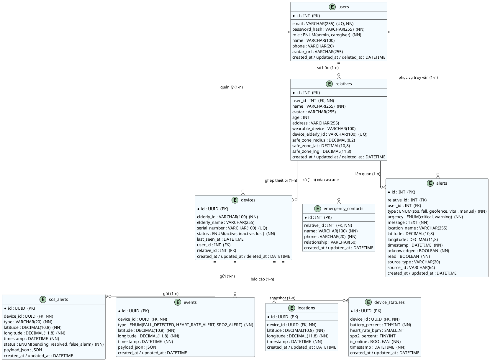

**Mô tả quan hệ:**
- `users` 1—n `relatives`: một tài khoản chăm sóc quản lý nhiều người cao tuổi.
- `users` 1—n `devices`: một user quản lý nhiều thiết bị (trường `user_id` trên `devices`).
- `relatives` 1—n `devices`: người thân ghép với thiết bị qua `relative_id` / `device_elderly_id`.
- `relatives` 1—n `emergency_contacts`: liên hệ khẩn cấp, xóa cascade theo người thân.
- `devices` 1—n `sos_alerts | events | locations | device_statuses`: mỗi thiết bị sinh nhiều dòng telemetries.
- `alerts` là bảng cảnh báo cấp người dùng, `user_id`/`relative_id` được denormalize để truy vấn nhanh theo user; `source_type`/`source_id` truy vết dòng telemetries gốc.

---

## 9. Sơ đồ Trạng thái

### 9.1 Trạng thái cảnh báo (Alert)

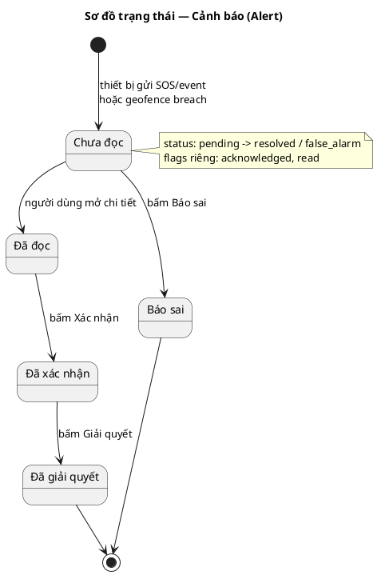

### 9.2 Trạng thái thiết bị (Device)

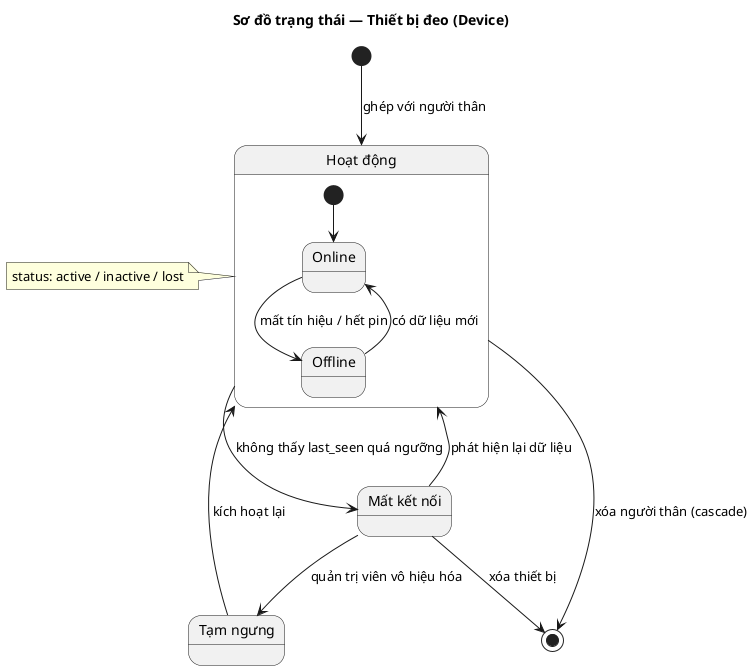

### 9.3 Trạng thái kết nối Socket.IO (app)

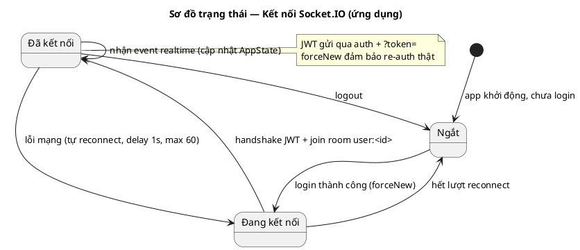

---

## 10. Sơ đồ Thành phần

> Sơ đồ thành phần thể hiện cấu trúc triển khai ba hệ thống con và các kết nối (REST, Socket.IO, DB).

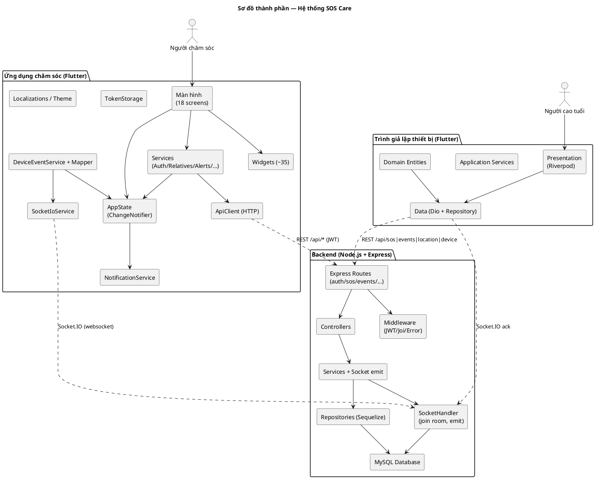

---

## Phụ lục — Danh mục sơ đồ

| # | Sơ đồ | Mục đích | Phần |
|---|-------|---------|------|
| 1 | Use Case Diagram | Tập hợp tác nhân & chức năng | §3 |
| 2 | Đặc tả Use Case | Mô tả chi tiết 6 use case chính | §4 |
| 3 | Activity Diagram (3) | Đăng nhập, xử lý cảnh báo, quản lý người thân | §5 |
| 4 | Sequence Diagram (4) | Login, SOS realtime, thêm người thân, lịch sử | §6 |
| 5 | Class Diagram | Cấu trúc lớp Flutter + backend | §7 |
| 6 | ERD | Cơ sở dữ liệu MySQL (9 thực thể) | §8 |
| 7 | State Diagram (3) | Alert, Device, Socket.IO | §9 |
| 8 | Component Diagram | Kiến trúc triển khai 3 hệ thống | §10 |

> **Cách render:** Dán từng khối `@startuml ... @enduml` vào PlantUML Web Server (plantuml.com) hoặc dùng extension PlantUML / VS Code PlantUML. Có thể xuất PNG/SVG.

---

## Câu hỏi còn mở (Unresolved Questions)

- **Q1:** Trong sơ đồ Use Case, hành động "Nghe xung quanh" / "Bật chuông thiết bị" từ xa hiện gửi qua kênh nào — REST riêng hay Socket.IO event tới thiết bị? Cần xác nhận để vẽ chính xác trình tự.
- **Q2:** `alerts.status` (pending/resolved/false_alarm) và cờ `acknowledged`/`read` có quan hệ chuyển trạng thái trùng lặp không — nên hợp nhất hay giữ tách biệt? Cần xác nhận ngữ nghĩa nghiệp vụ.
- **Q3:** Vùng an toàn (geofence) được tính phía backend (geofence service) hay phía app? README nhắc `geofence service` ở backend, nhưng app cũng có slider vùng an toàn — cần xác nhận nơi tính breach.