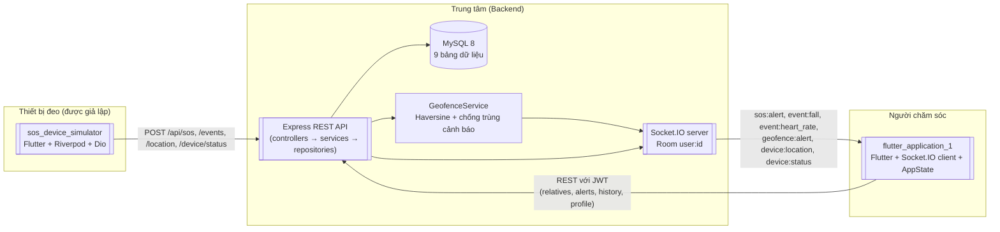
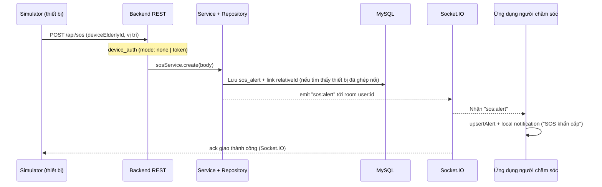
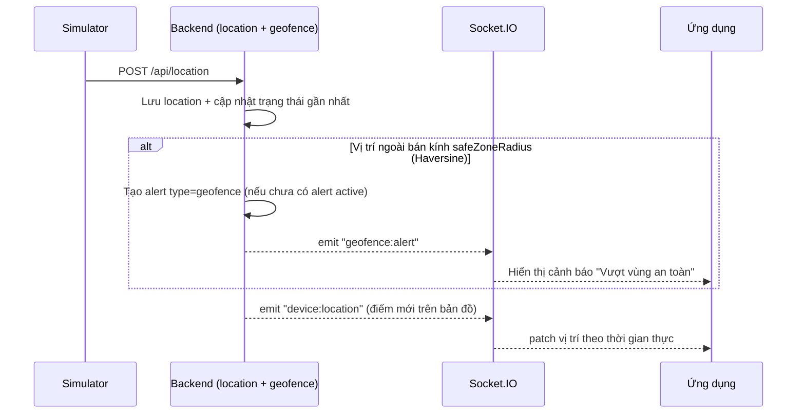

# SOS Care — Hệ thống giám sát và chăm sóc người cao tuổi theo thời gian thực

Hệ thống phân tán gồm ba thành phần phối hợp: ứng dụng Flutter dành cho người chăm sóc (con cái, bảo mẫu), backend Node.js/Express làm trung tâm dữ liệu và realtime, cùng trình giả lập thiết bị đeo SOS dành cho người cao tuổi phục vụ kiểm thử. Hệ thống giúp người thân theo dõi sức khỏe, vị trí và nhận cảnh báo tức thời (SOS, té ngã, nhịp tim bất thường, vượt vùng an toàn) của người cao tuổi, đồng thời cho phép tương tác từ xa.

---

## 1. Mục lục

1. Mô tả tổng quan
2. Mục tiêu
3. Bối cảnh và bài toán giải quyết
4. Tính năng chính
5. Đối tượng sử dụng
6. Công nghệ sử dụng
7. Kiến trúc hệ thống
8. Sơ đồ luồng hoạt động
9. Cấu trúc thư mục
10. Cách cài đặt
11. Cấu hình môi trường và biến môi trường
12. Cách chạy project trong môi trường phát triển
13. Cách build và deploy
14. Hướng dẫn sử dụng
15. API và các module quan trọng
16. Cơ sở dữ liệu và mô hình dữ liệu
17. Điểm nổi bật kỹ thuật
18. Khó khăn và cách xử lý
19. Kiểm thử
20. Kết quả đạt được
21. Bài học kinh nghiệm
22. Hướng phát triển
23. Nội dung có thể đưa vào CV
24. Thông tin chờ bổ sung

---

## 2. Mô tả tổng quan

SOS Care là một hệ thống phần mềm **ba khối (3-tier) phân tán** mô phỏng hoàn chỉnh giải pháp chăm sóc người cao tuổi từ xa, được xây dựng theo hướng **full-stack**:

| Thành phần | Công nghệ | Vai trò |
|-----------|----------|---------|
| `flutter_application_1` (thư mục gốc repo) | Flutter (>= 3.41), Dart (>= 3.12) | Ứng dụng chính cho người chăm sóc: tổng quan an toàn, cảnh báo realtime, bản đồ, chỉ số sức khỏe, hành động từ xa, quản lý người thân và liên hệ khẩn cấp |
| `Project_GiaLap/sos_care_backend` | Node.js (>= 18), Express, MySQL 8, Sequelize 6, Socket.IO 4 | Backend REST API + realtime: xác thực JWT, nhận dữ liệu thiết bị, phát cảnh báo qua Socket.IO theo room `user:<id>`, phát hiện vượt vùng an toàn phía máy chủ |
| `Project_GiaLap/sos_device_simulator` | Flutter + Riverpod + Dio + geolocator | Trình giả lập thiết bị đeo SOS (wearable) dành cho kiểm thử: gửi SOS, té ngã, nhịp tim bất thường, vị trí GPS, trạng thái thiết bị (pin, online) và nhận phản hồi giao thành công |

Luồng dữ liệu chính:

```
[sos_device_simulator] --HTTP/REST--> [sos_care_backend] --Socket.IO realtime--> [flutter_application_1]
                \                          ^                                      |
                 +--- Socket.IO ack -------+                                      |
                 (phản hồi giao thành công)                                       |
                                                                                  |
            [flutter_application_1] --REST (JWT)--> [sos_care_backend] (quản lý người thân, lịch sử, cấu hình)
```

Người chăm sóc đăng nhập vào ứng dụng Flutter, thêm người thân và gán mã thiết bị (`deviceElderlyId`). Khi người cao tuổi đeo thiết bị (ở đây là trình giả lập) nhấn nút SOS, hoặc hệ thống phát hiện té ngã, nhịp tim bất thường, vượt vùng an toàn, dữ liệu được gửi lên backend, backend kiểm tra và phát sự kiện Socket.IO tới room `user:<id>`, người chăm sóc nhận cảnh báo trên ứng dụng ngay lập tức kèm thông báo nội bộ (local notification).

---

## 3. Mục tiêu

- Xây dựng một hệ thống **giám sát người cao tuổi theo thời gian thực** hoàn chỉnh từ thiết bị đeo tới ứng dụng người chăm sóc, minh họa kỹ năng thiết kế hệ thống phần mềm phân tán end-to-end.
- Đảm bảo **thời gian phản hồi cảnh báo gần như tức thời** thông qua kiến trúc realtime Socket.IO thay vì polling.
- Cung cấp đầy đủ vòng đời sản phẩm: đăng ký/đăng nhập, quản lý hồ sơ, ghép nối thiết bị, giám sát, cảnh báo, lịch sử, cấu hình an toàn.
- Tối ưu chi phí: dùng bản đồ **OpenStreetMap miễn phí (Flutter Map)**, không phụ thuộc API key Google Maps.
- Kiểm thử được: đi kèm trình giả lập thiết bị và bộ test tự động phía backend.

---

## 4. Bối cảnh và bài toán giải quyết

**Bối cảnh.** Dân số già tăng nhanh, người cao tuổi ngày càng có nhu cầu ở nhà một mình hoặc với bảo mẫu trong khi con cháu đi làm xa. Người thân thường lo lắng khi không biết người cao tuổi có an toàn không, có gặp sự cố sức khỏe hay không, và gần như **bất lực** khi sự cố xảy ra mà không nắm được vị trí cụ thể.

**Bài toán.** Xây dựng một hệ thống cho phép:

1. Biết được người cao tuổi **đang ở đâu** và **sức khỏe như thế nào** (nhịp tim, SpO2, pin thiết bị) theo thời gian thực.
2. Ngay khi sự cố xảy ra (bấm nút SOS, té ngã, nhịp tim bất thường, rời khỏi vùng an toàn) thì **người chăm sóc nhận được cảnh báo tức thời** kèm vị trí.
3. Người chăm sóc có thể **hành động từ xa** (gọi điện, nghe xung quanh, bật chuông thiết bị, kích hoạt SOS từ xa) và tra cứu lịch sử sự cố để có phản ứng phù hợp.
4. Hệ thống phải **dễ kiểm thử** mà không cần thiết bị phần cứng vật lý, nhờ trình giả lập thiết bị đeo.

**Góc độ kỹ thuật.** Bài toán không chỉ đơn thuần là ghi nhận dữ liệu mà còn đòi hỏi: định tuyến sự kiện realtime theo đúng chủ sở hữu dữ liệu (không để người dùng A nhận cảnh báo của người dùng B), xác thực hai chiều (JWT cho người chăm sóc, device token cho thiết bị), truy vấn lịch sử có lọc, và xử lý nhất quán dữ liệu số thập phân (DECIMAL) từ MySQL khi truyền qua JSON.

---

## 5. Tính năng chính

### 5.1 Ứng dụng chính (flutter_application_1)

- **Tài khoản**: đăng ký / đăng nhập với JWT, tự động đăng xuất và quay về màn hình đăng nhập khi token hết hạn (HTTP 401 từ bất kỳ màn hình nào).
- **Tổng quan an toàn**: danh sách người thân kèm trạng thái thiết bị (online/offline, pin), banner cảnh báo SOS gần nhất, trạng thái kết nối realtime.
- **Cảnh báo realtime qua Socket.IO**: SOS, té ngã (FALL_DETECTED), nhịp tim bất thường, vượt vùng an toàn (geofence), kèm thông báo nội bộ (local notification) với mức độ nghiêm trọng khác nhau.
- **Lịch sử sự cố**: danh sách cảnh báo có bộ lọc loại sự cố, phân trang, xem chi tiết từng cảnh báo, đánh dấu đã đọc / đã xác nhận.
- **Bản đồ**: xem vị trí hiện tại của người thân (Flutter Map + OpenStreetMap, miễn phí không cần API key), vẽ vùng an toàn (geofence), modal bản đồ toàn màn hình.
- **Chỉ số sức khỏe**: nhịp tim, SpO2, mức pin; biểu đồ theo thời gian.
- **Hành động từ xa**: gọi điện, nghe xung quanh (ambient), bật chuông thiết bị, nhắn tin khẩn cấp, kích hoạt SOS từ xa.
- **Quản lý người thân**: thêm / sửa / xóa, tải ảnh đại diện, sắp xếp lại thứ tự ưu tiên; quản lý danh bạ liên hệ khẩn cấp.
- **Cấu hình**: chế độ Sáng/Tối toàn hệ thống, hai ngôn ngữ Tiếng Việt / English, cài đặt thông báo, bán kính vùng an toàn.
- **Đa nền tảng**: sẵn sàng cho Android và Windows.

### 5.2 Backend (sos_care_backend)

- Xác thực JWT cho người chăm sóc; xác thực thiết bị bằng `X-Device-Token` (bật qua `DEVICE_AUTH_MODE=token`, mặc định public trong dev).
- Nhận dữ liệu từ thiết bị: SOS, sự kiện (té ngã / nhịp tim bất thường), vị trí GPS, trạng thái (pin, nhịp tim, SpO2, online), mức pin.
- Phát sự kiện Socket.IO theo room `user:<id>` để đúng người, đúng sự kiện.
- **Phát hiện vượt vùng an toàn phía máy chủ**: tính khoảng cách Haversine từ tọa độ mới tới tâm vùng an toàn, tránh phát trùng cảnh báo khi vẫn còn cảnh báo chưa xác nhận.
- Quản lý người thân, liên hệ khẩn cấp, cảnh báo (bao gồm alert tạo thủ công), lịch sử có phân trang và lọc, hồ sơ người dùng, tải ảnh đại diện (multipart, giới hạn 5 MB).
- Response envelope thống nhất `{ success, data, message, errors }`, xử lý lỗi tập trung, validation Joi trên toàn bộ endpoint nhận dữ liệu.
- An toàn cơ bản: Helmet, CORS cấu hình được, log ẩn query string (không lộ token Socket.IO), kiểm tra biến môi trường bắt buộc lúc khởi động, graceful shutdown khi nhận SIGINT/SIGTERM.

### 5.3 Trình giả lập thiết bị (sos_device_simulator)

- Nút SOS gửi cảnh báo khẩn cấp.
- Trượt chỉnh mức pin, nhịp tim; bật/tắt trạng thái online; gửi về `/api/device/status`.
- Gửi vị trí GPS thực (geolocator) qua `/api/location`.
- Gửi sự kiện té ngã / nhịp tim bất thường qua `/api/events`.
- Nhận xác nhận giao thành công từ backend qua Socket.IO ack.
- Cơ chế mock (`useMock`) để chạy demo không cần backend và khả năng chỉnh mã `deviceElderlyId` để ghép nối với người thân trong ứng dụng chính.

---

## 6. Đối tượng sử dụng

- **Người chăm sóc chính** (con cái, cháu, người thân của người cao tuổi): dùng ứng dụng main để giám sát, nhận cảnh báo và hành động từ xa.
- **Bảo mẫu / người giúp việc**: theo dõi thường xuyên các chỉ số và vị trí trong ca trực.
- **Đội ngũ kiểm thử / demo**: dùng trình giả lập thiết bị để mô phỏng đủ tình huống sự cố mà không cần phần cứng thật.
- **Nhà phát triển nghiên cứu giải pháp IoT chăm sóc sức khỏe**: tham khảo kiến trúc realtime, geofence phía server, và quy trình tích hợp nhiều ứng dụng.

Lưu ý: dữ liệu người dùng thật (số lượng triển khai thực tế) chưa có; đây là dự án dạng sản phẩm mẫu / đồ án kỹ thuật đầy đủ quy trình.

---

## 7. Công nghệ sử dụng

### 7.1 Ứng dụng chính (flutter_application_1)

| Công nghệ / thư viện | Mục đích |
|-----|----------|
| Flutter / Dart | Framework đa nền tảng (Android, Windows) |
| `socket_io_client` (2.x) | Kết nối realtime tới backend, JWT handshake auth, auto reconnect |
| `http` | HTTP client gọi REST API |
| `shared_preferences` | Lưu JWT và cấu hình local |
| `flutter_map` + `latlong2` | Bản đồ OpenStreetMap miễn phí, đa điểm, vùng an toàn |
| `geocoding` | Reverse geocoding qua Nominatim với cache |
| `image_picker` | Chọn ảnh đại diện từ thư viện / camera |
| `flutter_local_notifications` | Thông báo nội bộ (SOS, té ngã, nhịp tim, pin thấp) |
| `cupertino_icons` | Biểu tượng iOS style |

Quản lý trạng thái: `ChangeNotifier` singleton (`AppState`) + `AnimatedBuilder`; không dùng package state management bên thứ ba cho app chính.

### 7.2 Backend (sos_care_backend)

| Công nghệ / thư viện | Mục đích |
|-----|----------|
| Node.js (>= 18) | Nền tảng chạy |
| Express (4.21) | Web framework, routing, middleware |
| MySQL 8 + Sequelize 6 (ORM) | Lưu trữ dữ liệu quan hệ, migration, association |
| Socket.IO (4.8) | Realtime bidirectional, room-scope theo user |
| jsonwebtoken + bcryptjs | JWT và mã hóa mật khẩu |
| Joi | Validation payload tất cả endpoint nhận dữ liệu |
| Winston + winston-daily-rotate-file | Log theo ngày, mức log cấu hình được |
| morgan | Log HTTP (che query string) |
| helmet + cors | Bảo mật header và CORS cấu hình được |
| multer | Upload ảnh đại diện (max 5 MB) |
| uuid | Sinh mã định danh |
| Jest + Supertest | Unit và integration test |

### 7.3 Trình giả lập thiết bị (sos_device_simulator)

| Công nghệ / thư viện | Mục đích |
|-----|----------|
| Flutter + Riverpod (2.x) | Quản lý state |
| Dio (5.x) | HTTP client với Result/Failure pattern |
| `socket_io_client` | Nhận Socket.IO ack từ backend |
| geolocator | Vị trí GPS thực |
| dartz | Kiểu `Result` (Either) cho xử lý lỗi chức năng |
| intl | Định dạng ngày giờ |

---

## 8. Kiến trúc hệ thống

Hệ thống gồm ba phần mềm độc lập, giao tiếp qua REST và Socket.IO:



### 8.1 Backend — tách lớp 3 tầng

```
HTTP Request → Controllers (parse + envelope) → Services (business logic + emit Socket.IO) → Repositories (Sequelize) → MySQL
                                                          ↑
                                            Logger / Error handler tập trung
```

- **Controllers** chỉ nhận request, gọi service, trả về response theo envelope chung.
- **Services** chứa nghiệp vụ: tạo alert, quản lý người thân, telemetry, geofence, phát Socket.IO.
- **Repositories** cô lập truy vấn Sequelize, có `base.repository.js` dùng chung.
- **Middleware**: `auth` (JWT), `device_auth` (token thiết bị), `validate` (Joi), `upload`, `logger`, `error`.

### 8.2 Realtime — Socket.IO room-scope

- Backend đọc JWT từ ba nguồn trong handshake: `auth.token`, header `Authorization`, và query `?token=`.
- Socket hợp lệ được join room `user:<id>` (id lấy từ JWT). Mọi sự kiện cảnh báo/telemetry được phát bằng `io.to('user:<id>')` — chỉ tài khoản sở hữu thiết bị nhận được, loại bỏ tiếng ồn và rủi ro lộ dữ liệu chéo.
- Socket không có JWT (hoặc token sai) vẫn được phép kết nối nhưng **không join room nào**, do đó không nhận event scoped; không làm crash client khi token chưa refresh.

### 8.3 Ứng dụng chính — Singleton + ChangeNotifier

- `ApiClient` (singleton HTTP): tự gắn `Authorization: Bearer <jwt>`, unwrap envelope, tự xử lý 401 (xóa token, đăng xuất, quay về Login qua `GlobalKey<NavigatorState>`).
- `SocketIoService` (wrapper `socket_io_client`): transport websocket, `forceNew`, auto reconnect 60 lần delay 1 s, tự gắn lại listener sau mỗi lần kết nối.
- `DeviceEventService` (singleton): lắng nghe sự kiện realtime, parse payload theo kiểu nhượng, gọi `AppState().upsertAlert(...)` / `patchElderlyVitals(...)`, và hiển thị local notification.
- `AppState` (singleton `ChangeNotifier`): giữ người thân, cảnh báo, cài đặt; UI lắng nghe qua `AnimatedBuilder`.

### 8.4 Trình giả lập — Clean Architecture

Tách `domain` (entity + interface repository) / `data` (remote + mock data source) / `presentation` (Riverpod + screens + widgets), dùng kiểu `Result` (dartz) thay cho exception để xử lý lỗi chủ động. Có thể chạy ở chế độ `useMock` khi không có backend.

---

## 9. Sơ đồ luồng hoạt động

### 9.1 Luồng cảnh báo SOS từ thiết bị tới người chăm sóc



### 9.2 Luồng vị trí và phát hiện vượt vùng an toàn



---

## 10. Cấu trúc thư mục

```
flutter_application_1/                         # Ứng dụng chính (repo gốc)
  lib/
    main.dart               # Khởi động: notification, ApiClient, Socket.IO, AppState, xử lý 401 toàn cục
    models/                 # user_profile, elderly, alert, emergency_contact, address, app_settings
    services/               # api_client, auth_service, token_storage, alerts_api_service,
                            # relatives_api_service, address_service, device_event_service,
                            # device_event_mapper, socket_io_service, notification_service
    utils/                  # app_state (ChangeNotifier singleton), localization (vi/en), theme (Sáng/Tối)
    screens/                # 19 màn hình: login, register, home, alerts, alert_detail, elderly_detail,
                            # map_view, health_tracking, remote_sos, ambient_listen, ringing_device,
                            # send_sms, profile, settings, emergency_contacts, edit_relative, add_alert, ...
    widgets/                # 30+ widget tái sử dụng: card, badge, dialog, nav, chart, map overlay, ...
  start.bat                 # Khởi động đồng thời backend + 2 app (Windows)
  Project_GiaLap/
    sos_care_backend/       # Backend Node.js (xem dưới)
    sos_device_simulator/   # Trình giả lập thiết bị (xem dưới)

Project_GiaLap/sos_care_backend/
  src/
    config/                 # database.js, env.config.js, sequelize-cli.config.js
    controllers/            # 12 controller: auth, user, relative, alert, sos, event, location,
                            # device, device_status, battery, history, health
    services/               # Nghiệp vụ + socket.service.js, socket.handler.js, geofence.service.js
    repositories/           # base.repository + repository theo thực thể
    models/                 # 9 model: user, device, location, sos_alert, event, device_status,
                            # relative, emergency_contact, alert
    routes/                 # Router Express (13 file runtime)
    middleware/             # auth, device_auth, validate, upload, error, logger
    validations/            # 10 schema Joi
    utils/                  # response, logger, app_error
    app.js                  # Express app factory
    server.js               # Bootstrap: DB → HTTP + Socket.IO → graceful shutdown
  migrations/               # 12 migration Sequelize
  tests/                    # 6 bộ test (Jest + Supertest) + helpers
  .env.template             # Mẫu biến môi trường
  package.json

Project_GiaLap/sos_device_simulator/
  lib/
    core/
      config/api_config.dart        # baseUrl, useMock
      services/dio_client.dart      # Dio + error interceptor
      services/socket_io_service.dart  # Nhận ack từ backend
      errors/failure.dart
      utils/                        # debouncer, throttle_helper
    features/sos_simulator/
      application/services/         # location_service
      data/models/                  # api_response, battery, device_status, event, location, sos payload
      data/repositories/            # mock_data_source, remote_data_source, repository_impl
      domain/entities/              # device_status, operation_result
      domain/repositories/          # sos_simulator_repository (interface)
      presentation/                 # providers (Riverpod), screens, widgets
```

---

## 11. Cách cài đặt

### 11.1 Yêu cầu môi trường

- Node.js LTS >= 18 (backend)
- MySQL 8+
- Flutter >= 3.41, Dart >= 3.12 (cả hai ứng dụng Flutter)
- Android Studio / Flutter SDK hoạt động; Windows có thể dùng luồng build Windows của Flutter

### 11.2 Backend

```bash
cd "Project_GiaLap/sos_care_backend"
npm install
cp .env.template .env        # sửa thông tin MySQL + JWT secret
npx sequelize-cli db:create
npm run migrate
```

### 11.3 Ứng dụng chính

```bash
flutter pub get
```

### 11.4 Trình giả lập

```bash
cd "Project_GiaLap/sos_device_simulator"
flutter pub get
```

---

## 12. Cấu hình môi trường và biến môi trường

File cấu hình chính của backend là `.env` (tạo từ `.env.template`). Danh sách biến:

| Biến | Mặc định | Ý nghĩa |
|------|----------|---------|
| `PORT` | `8081` | Cổng HTTP + Socket.IO |
| `NODE_ENV` | `development` | Môi trường chạy; `test` tự thêm hậu tố `_test` vào tên DB |
| `DB_HOST` | `localhost` | Host MySQL |
| `DB_PORT` | `3306` | Port MySQL |
| `DB_NAME` | `sos_care_db` | Tên database |
| `DB_USER` / `DB_PASS` | `root` / trống | Tài khoản MySQL |
| `JWT_SECRET` | (bắt buộc) | Khóa ký JWT; thiếu sẽ không khởi động được |
| `JWT_EXPIRES_IN` | `7d` | Thời hạn token (khuyến nghị <= 30d production) |
| `LOG_LEVEL` | `info` | Mức log Winston |
| `LOG_TO_FILE` | `true` | Ghi log ra file (daily rotate); `false` để giảm I/O khi dev |
| `DB_SYNC` | `false` | Bật `sequelize.sync({ alter })` khi khởi động (chỉ dùng dev) |
| `CORS_ORIGIN` | `*` | Origin cho phép; danh sách phân tách dấu phẩy |
| `DEVICE_AUTH_MODE` | `none` | `none` = public (dev); `token` = yêu cầu `X-Device-Token` |
| `DEVICE_TOKEN` | — | Token thiết bị dùng chung khi `DEVICE_AUTH_MODE=token` |

Kiểm tra an toàn lúc khởi động: hệ thống in **tên** biến thiếu chứ không in giá trị; nếu `DEVICE_AUTH_MODE=none` trong production sẽ in cảnh báo. Log HTTP chỉ ghi đường dẫn, không ghi query string (tránh lộ `?token=` của Socket.IO).

Cấu hình hai ứng dụng Flutter đều nằm trong code (chưa cung cấp qua environment riêng):

- App chính: `lib/main.dart` — `_kSosBackendUrl = 'http://localhost:8081'`, tự đổi `localhost → 10.0.2.2` trên Android emulator.
- Simulator: `lib/core/config/api_config.dart` — `baseUrl = 'http://localhost:8081'`, `useMock = false`. Trên Android emulator dùng `http://10.0.2.2:8081`.

---

## 13. Cách chạy project trong môi trường phát triển

```bash
# 1. Backend (cần MySQL đang chạy)
cd "Project_GiaLap/sos_care_backend"
npm run dev                 # nodemon — hot reload

# 2. Ứng dụng chính (cửa sổ khác)
flutter run

# 3. Trình giả lập (cửa sổ khác)
cd "Project_GiaLap/sos_device_simulator"
flutter run
```

Backend chạy tại `http://localhost:8081`; kiểm tra nhanh: `GET /health`.

**Windows:** chạy `start.bat` ở gốc repo — script hỏi có tạo lại database không (Y = `db:drop` + `db:create` + `migrate`, N = giữ nguyên), sau đó mở ba cửa sổ cmd chạy backend và hai ứng dụng Flutter. Lưu ý: file còn chứa đường dẫn tuyệt đối cũ; nếu đổi vị trí repo, cập nhật biến `BACKEND`, `SIMULATOR`, `ROOT` trong `start.bat`.

**Lịch trình khởi động hợp lý (demo):**

1. Khởi động backend → tạo DB + migrate → chờ log "đang chạy tại http://localhost:8081".
2. Đăng ký / đăng nhập trên ứng dụng chính.
3. Thêm người thân trong ứng dụng chính, ghi lại mã thiết bị (`deviceElderlyId`, ví dụ `ELDERLY-001`).
4. Mở simulator, nhập đúng mã thiết bị đó.
5. Từ simulator bấm SOS / kéo pin thấp / gửi sự kiện té ngã / thay đổi vị trí → ứng dụng chính phải hiện cảnh báo realtime, thông báo nội bộ và cập nhật bản đồ.

---

## 14. Cách build và deploy

### 14.1 Build ứng dụng Flutter

```bash
# App chính — Android APK
cd "D:\App Mobile\flutter_application_1"
flutter build apk --release

# App chính — Windows (nếu cần bản desktop)
flutter build windows --release

# Trình giả lập — Android APK
cd "Project_GiaLap/sos_device_simulator"
flutter build apk --release
```

### 14.2 Backend — production

```bash
cd "Project_GiaLap/sos_care_backend"
npm install --omit=dev
npm start                   # NODE_ENV=production + biến môi trường đầy đủ trong .env
```

### 14.3 Ghi chú deploy

- **Trạng thái hiện tại**: repo chưa có file Docker, docker-compose hoặc pipeline CI/CD. Phần deploy bên dưới là khuyến nghị dựa trên kiến trúc hiện có và cần được bổ sung/hiện thực hóa cho từng môi trường.
- **Khuyến nghị**: chạy backend sau reverse proxy (ngrok hoặc Nginx/Caddy) với HTTPS; đặt `DEVICE_AUTH_MODE=token` và cấu hình `CORS_ORIGIN` thành danh sách origin tin cậy; đổi `JWT_SECRET` và `DEVICE_TOKEN`; tắt `DB_SYNC=true` (bắt buộc) vì trong production backend bỏ qua đồng bộ model để tránh mất dữ liệu.
- **MySQL production**: tạo user/config riêng, sao lưu định kỳ. Đường dẫn backup hiện có trong repo: `mysql_data_backup_20260901` (dữ liệu thủ công, chưa có script tự động).
- **Chưa đề cập cụ thể trong repo**: cấu hình process manager (PM2/systemd), monitoring, log aggregation. Cần bổ sung khi triển khai thật.

---

## 15. Hướng dẫn sử dụng

1. **Đăng ký** tài khoản từ màn hình Register, sau đó **đăng nhập** (JWT được lưu, socket tự re-connect có token).
2. **Thêm người thân** ở màn hình chính: nhập tên, tuổi, địa chỉ, mã thiết bị (`deviceElderlyId`), bán kính vùng an toàn, tọa độ tâm vùng. Khai báo **liên hệ khẩn cấp** cho người thân nếu cần.
3. **Ghép nối simulator**: mở simulator, sửa mã thiết bị cho khớp với `deviceElderlyId` đã khai báo.
4. **Theo dõi**: màn hình Home hiển thị danh sách người thân kèm pin, online, vị trí; tab Bản đồ hiển thị điểm và vùng an toàn; tab Sức khỏe hiển thị nhịp tim / SpO2 / pin theo thời gian.
5. **Nhận cảnh báo**: khi simulator bấm SOS, gửi té ngã, nhịp tim bất thường hoặc rời vùng an toàn, ứng dụng hiển thị cảnh báo ngay + notification nội bộ; vào tab Cảnh báo để xem lịch sử, lọc, đánh dấu đã đọc.
6. **Hành động từ xa**: từ chi tiết người thân, dùng các nút Gọi, Nghe xung quanh, Bật chuông, Nhắn tin khẩn cấp, Kích hoạt SOS từ xa.

Lưu ý: các thao tác "hành động từ xa" hiện có nghiệp vụ UI/phân luồng phía ứng dụng; phần backend phục vụ các hành động này có thể cần bổ sung nếu triển khai thật.

---

## 16. API và các module quan trọng

### 16.1 Response envelope

Mọi response dùng dạng `{ success, data, message, errors }`. `ApiClient` phía Flutter tự lấy `data`.

### 16.2 Bảng API chính

| Method | Endpoint | Xác thực | Mô tả |
|--------|----------|----------|-------|
| GET | `/health` | Public | Health check |
| POST | `/api/auth/register` | Public | Đăng ký tài khoản (bcrypt hash + Joi) |
| POST | `/api/auth/login` | Public | Đăng nhập, trả JWT |
| GET | `/api/users/me`, `/api/users/profile` | JWT | Hồ sơ tài khoản (kèm alias `/api/user`, `/api/profile`, `/profile`) |
| GET | `/api/users/:id` | JWT | Chi tiết tài khoản — chỉ trả khi là chính chủ, ngược lại 404 |
| GET | `/api/relatives` | JWT | Danh sách người thân |
| POST | `/api/relatives` | JWT | Thêm người thân |
| GET | `/api/relatives/:id` | JWT | Chi tiết người thân |
| PUT | `/api/relatives/:id` | JWT | Cập nhật người thân (gồm vùng an toàn, mã thiết bị) |
| DELETE | `/api/relatives/:id` | JWT | Xóa người thân (soft delete — paranoid) |
| PUT | `/api/relatives/:id/avatar` | JWT | Upload avatar (multipart, field `avatar`, max 5 MB) |
| GET/POST | `/api/relatives/:id/contacts`, DELETE `/contacts/:contactId` | JWT | Quản lý liên hệ khẩn cấp |
| GET | `/api/alerts` | JWT | Danh sách cảnh báo (phân trang + lọc) |
| POST | `/api/alerts` | JWT | Tạo cảnh báo thủ công |
| PATCH | `/api/alerts/:id/acknowledge`, `/read` | JWT | Xác nhận / đánh dấu đã đọc |
| POST | `/api/alerts/mark-all-read` | JWT | Đọc tất cả |
| POST | `/api/sos` | Device token (dev: public) | Nhận cảnh báo SOS từ thiết bị |
| POST | `/api/events` | Device token | Nhận sự kiện (FALL_DETECTED, HEART_RATE_ALERT, ...) |
| POST | `/api/location` | Device token | Nhận vị trí GPS + chạy geofence |
| POST | `/api/device/status` | Device token | Cập nhật pin/nhịp tim/SpO2/online |
| POST | `/api/device/battery` | Device token | Cập nhật mức pin (payload tối thiểu, alias tương thích) |
| GET | `/api/device/:id` | JWT | Chi tiết thiết bị (scope theo tài khoản) |
| GET | `/api/history` | JWT | Lịch sử SOS/events/locations (phân trang + lọc) |

### 16.3 Socket.IO events

| Event | Khi phát | Payload chính |
|-------|----------|---------------|
| `sos:alert` | POST `/api/sos` | id, deviceId, elderlyId, relativeId, alertId, type, latitude, longitude, timestamp, status, message |
| `event:fall` | POST `/api/events` type=FALL_DETECTED | tương tự alert class |
| `event:heart_rate` | type=HEART_RATE_ALERT | tương tự |
| `geofence:alert` | POST `/api/location` khi vượt vùng an toàn | kèm tọa độ, bán kính, message tiếng Việt |
| `device:location` | POST `/api/location` | id, deviceId, elderlyId, relativeId, latitude, longitude, timestamp |
| `device:status` | POST `/api/device/status` hoặc `/battery` | id, deviceId, elderlyId, relativeId, batteryPercent, heartRateBpm, spo2Percent, isOnline, timestamp |

Backend **augment** payload với `relativeId` (int, = id của người thân) và `alertId` để client không cần tự tra cứu/giả lập quan hệ thiết bị → người thân.

### 16.4 Module nổi bật

- `socket.handler.js`: xác thực socket qua 3 nguồn token và join room `user:<id>`; hỗ trợ lệnh `subscribe` chỉ cho phép vào room của chính mình (SOS Care backend `Project_GiaLap/sos_care_backend/src/services/socket.handler.js`).
- `geofence.service.js`: khoảng cách Haversine (bán kính Trái Đất 6371 km), tránh spam bằng cách chỉ tạo cảnh báo khi chưa có cảnh báo geofence active chưa ack (SOS Care backend `Project_GiaLap/sos_care_backend/src/services/geofence.service.js`).
- `api_client.dart`: singleton HTTP unwrap envelope, xử lý 401 đúng ngữ nghĩa (không nhầm lỗi đăng nhập với hết hạn session) (SOS Care app `lib/services/api_client.dart`).
- `socket_io_service.dart`: JWT gửi qua hai kênh (auth object + query), `forceNew` chống tái dùng Manager cũ mất realtime sau re-login (SOS Care app `lib/services/socket_io_service.dart`).

---

## 17. Cơ sở dữ liệu và mô hình dữ liệu

MySQL với Sequelize, 12 migration. Các bảng chính:

| Bảng | Vai trò chính |
|------|---------------|
| `users` | Tài khoản người chăm sóc; có cột profile (migration bổ sung: tên hiển thị, avatar, ngôn ngữ, dark mode, ...) |
| `relatives` | Người thân (elderly) thuộc một `userId`; kiểu paranoid (soft delete); chứa `deviceElderlyId` (khóa ghép nối thiết bị, unique), `safeZoneRadius` (DECIMAL, mặc định 500), `safeZoneLat`/`safeZoneLng` |
| `devices` | Thiết bị đeo |
| `locations` | Lịch sử vị trí GPS |
| `sos_alerts` | Cảnh báo SOS từ thiết bị |
| `events` | Sự kiện thiết bị (có cột `type` hỗ trợ FALL_DETECTED / HEART_RATE_ALERT — migration bổ sung) |
| `device_statuses` | Trạng thái mới nhất: pin, nhịp tim, SpO2, online |
| `emergency_contacts` | Liên hệ khẩn cấp của người thân |
| `alerts` | Bảng cảnh báo gộp (SOS, fall, vital, geofence, manual) với `type`, `urgency`, `acknowledged`, `read`, v.v.; liên kết relative |

Đặc điểm quan trọng:

- Các cột tọa độ/bán kính dùng **DECIMAL**: khi truyền qua JSON/HTTP, giá trị trả về là **String** (không phải number). Ứng dụng Flutter bắt buộc parse kiểu nhượng (`DeviceEventMapper.doubleVal`, `intVal`, `boolVal`) thay vì ép `as num?`, tránh crash khi dữ liệu không đúng kiểu giả định.
- Vitals (nhịp tim, SpO2, pin, vị trí) **không lưu trong bảng relatives**; chúng được suy ra tại thời điểm đọc từ bản ghi mới nhất của locations/device_statuses cộng với alert đang active — tránh mất đồng bộ và giảm ghi chồng chéo.
- Environment `test` dùng DB riêng `<DB_NAME>_test` để không ghi đè dữ liệu dev/prod khi chạy Jest.

---

## 18. Điểm nổi bật kỹ thuật

1. **Hệ thống phân tán 3 thành phần hoàn chỉnh**: device simulator → backend → mobile app, chia trách nhiệm rõ ràng, mỗi thành phần chạy được độc lập (simulator có chế độ mock).
2. **Realtime đúng người, đúng việc**: Socket.IO room `user:<id>` + JWT handshake từ 3 nguồn token; auto reconnect 60 lần / delay 1 s; `forceNew` khi re-login để không mất luồng realtime.
3. **Geofence phía máy chủ bằng Haversine** với cơ chế chống trùng lặp cảnh báo — không dựa vào client, không tốn chi phí dịch vụ map.
4. **Bản đồ miễn phí hoàn toàn**: Flutter Map + OpenStreetMap + Nominatim reverse geocoding có cache, không cần API key Google Maps.
5. **Xác thực token tự động hết hạn**: `ApiClient` phát hiện 401 toàn cục, phân biệt đúng "đăng nhập sai" (không xóa session) với "phiên hết hạn" (logout + về login); handle qua `GlobalKey<NavigatorState>` từ bất kỳ màn hình nào.
6. **Dữ liệu DECIMAL kiểm chứng thực tế**: toàn bộ tầng parse của Flutter dùng bộ converter kiểu nhượng, chuyển nhu cầu hạ tầng (String→num) thành giải pháp dùng chung.
7. **Backend có tổ chức**: 3 tầng controller/service/repository, response envelope đồng nhất, Joi validation toàn bộ, error handler tập trung, log cẩn trọng (che query string), graceful shutdown, health check.
8. **Kiểm thử tự động phía backend**: Jest + Supertest với môi trường test DB riêng (`*_test`), phủ luồng xác thực, profile, relatives, alert, ingest thiết bị và geofence.
9. **Đa ngôn ngữ + đa theme**: hệ thống i18n vi/en và dark/light được lưu theo tài khoản, áp dụng toàn app qua ChangeNotifier.
10. **Clean Architecture ở simulator** (domain/data/presentation) + Riverpod + Result type (dartz) — minh chứng khả năng phát triển có cấu trúc ở mức dự án phức tạp hơn.

---

## 19. Khó khăn và cách xử lý

| Khó khăn | Cách xử lý trong dự án |
|----------|------------------------|
| Realtime mất kết nối sau re-login, phải khởi động lại app mới nhận event | Gửi JWT qua cả `auth` object lẫn `?token=` query; dùng `enableForceNew()` để tạo Manager mới; tự gắn lại listener sau mỗi lần connect; reconnect 60 lần delay 1 s |
| Dữ liệu tọa độ dạng DECIMAL trả về String làm crash crash do ép kiểu `as num?` | Xây bộ parser nhượng (`DeviceEventMapper`) dùng chung cho mọi field; chuẩn hóa quy ước parse ở tầng service |
| Nhận cảnh báo "lạc loài" (người dùng A thấy dữ liệu người dùng B) hoặc event thừa của thiết bị chưa ghép nối | Backend join room `user:<id>`; payload augment `relativeId`/`alertId`; client fallback khớp theo mã thiết bị, bỏ event khi không có người thân tương ứng |
| Trùng lặp cảnh báo geofence khi thiết bị liên tục ở ngoài vùng | Chỉ tạo alert mới khi chưa tồn tại alert geofence active chưa được acknowledge; mỗi lần vào vùng an toàn lại mở khóa |
| 401 gây nhầm lẫn: đăng nhập sai bị xử lý như hết hạn session | Loại trừ request `/api/auth/` khỏi pipeline onUnauthorized; 401 khác mới xóa token + logout về LoginScreen |
| MySQL DECIMAL + Sequelize truyền qua REST/JSON không đồng nhất kiểu | Quy ước: cột số thập phân dùng DECIMAL, service parse mềm, test phủ luồng đọc/ghi |
| Cấu hình CORS cho cả HTTP lẫn Socket.IO | Một biến `CORS_ORIGIN` quản lý cả hai cổng (Express `cors()` và `Server` Socket.IO) |
| Thiếu thiết bị phần cứng khi phát triển | Xây simulator có cấu hình `useMock`; dùng `10.0.2.2` cho emulator; start.bat phối hợp 3 tiến trình |

---

## 20. Kiểm thử

Backend sử dụng Jest + Supertest (`npm test` — có báo cáo coverage). Môi trường test dùng DB riêng `<DB_NAME>_test` (khớp với cấu hình sequelize-cli cho môi trường test) và có bộ helper chung trong `tests/helpers/`.

| Bộ test | Phạm vi |
|---------|---------|
| `app.test.js` | Khởi tạo app, routing, envelope response, error handler |
| `profile.test.js` | Đăng ký, đăng nhập, lấy hồ sơ, kiểm tra yêu cầu JWT (chi tiết nằm trong `profile.test.js`) |
| `relatives.test.js` | CRUD người thân, liên hệ khẩn cấp, scope theo tài khoản |
| `alerts.test.js` | Danh sách, phân trang, acknowledge, mark read, alert thủ công |
| `ingest.test.js` | Luồng nhận dữ liệu thiết bị (sos/events/location/status) |
| `geofence.test.js` | Tính toán Haversine và logic chống trùng cảnh báo |

Trạng thái hiện tại: số lượng test cụ thể và % coverage chưa được ghi nhận lại; xem kết quả khi chạy `npm test` (cần bổ sung số liệu vào mục Kết quả đạt được).

Hai ứng dụng Flutter chưa có bộ test widget/e2e trong repo (chỉ có mẫu `flutter_test` mặc định) — đây là mục cần bổ sung.

---

## 21. Kết quả đạt được

**Đã kiểm chứng trong repo:**

- Hệ thống 3 thành phần hoạt động phối hợp end-to-end: thiết bị giả lập → backend → ứng dụng người chăm sóc, kịch bản SOS/té ngã/nhịp tim/geofence đầy đủ.
- Backend tương đối hoàn chỉnh: 9 model, 12 migration, 13 route runtime, 12 controller, 13 service file (11 nghiệp vụ + socket handler/service), 6 bộ test tự động.
- App chính: 19 màn hình, 30+ widget tái sử dụng, đa ngôn ngữ vi/en, theme Sáng/Tối, bản đồ + geofence miễn phí không API key.
- Simulator: kiến trúc Clean Architecture, chạy được cả chế độ có/mock backend.

**Chưa có số liệu (cần bổ sung để dùng cho CV):**

- Số lượng test và % coverage cụ thể.
- Số người dùng / phiên demo thực tế, thời gian phản hồi cảnh báo đo được (ms).
- Ảnh/screenshot chạy demo.

**Cách dùng cho CV:** mô tả ở mục 23.

---

## 22. Bài học kinh nghiệm

1. **Thiết kế realtime cần xét tới tái kết nối trước, không phải kết nối lần đầu.** Vấn đề "re-login mất realtime" đến từ việc client Tái sử dụng Manager/room cũ — giải quyết bằng JWT đa kênh + `forceNew` + reattach listener.
2. **Quy ước dữ liệu phải thống nhất xuyên tầng.** Một kiểu dữ liệu "bất ngờ" (DECIMAL → String) nếu không chuẩn hóa bộ parse sẽ sinh cả loạt crash khó lường; đưa nó về một util dùng chung là tối ưu chi phí bảo trì.
3. **Security-by-default ở mức vừa đủ:** log không lộ query string, kiểm tra biến môi trường bắt buộc, cảnh báo device auth tắt trong production, không trả lộ dữ liệu người khác (404 thay vì lộ tồn tại) — những chi tiết nhỏ tạo nên độ tin cậy của hệ thống.
4. **Phân tầng giúp kiểm thử dễ hơn:** tách repositories khỏi services và dùng Supertest với DB test riêng giúp viết test nhanh, chạy song song mà không đè dữ liệu dev/prod.
5. **Có simulator/mock từ đầu là quyết định đúng đắn:** giúp phát triển app chính song song mà không chờ thiết bị thật, đồng thời trở thành tài sản demo.

---

## 23. Hướng phát triển

- **Thiết bị thật**: thay simulator bằng firmware/hardware phát sinh đúng protocol `POST /api/sos|events|location|device/status`, bật `DEVICE_AUTH_MODE=token`.
- **Thông báo đẩy nền** (Firebase Cloud Messaging / push notification) để nhận cảnh báo khi app bị đóng hoàn toàn.
- **Backend cho các hành động từ xa**: chưa có endpoint/service thực hiện gọi điện, nghe ambient, bật chuông — hiện mới có UI và khung nghiệp vụ phía app.
- **Real-time dashboard web** cho nhà điều hành / trung tâm chăm sóc.
- **Nâng cấp**: Docker Compose cho backend + MySQL, CI/CD (build + test + deploy), monitoring (PM2/systemd, log aggregation).
- **Cảnh báo thông minh hơn**: học ngưỡng nhịp tim cá nhân, tích hợp lịch sử y tế, báo cáo định kỳ.
- **Test tăng cường**: bổ sung kiểm thử Flutter (widget/integration) cho app chính và simulator.

---

## 24. Nội dung có thể đưa vào CV

**Vai trò** (bổ sung sau, ví dụ: Tác giả / Kỹ sư phần mềm, Fullstack Flutter + Node.js):

- Thiết kế và triển khai hệ thống phân tán 3 thành phần giám sát người cao tuổi theo thời gian thực — mô hình IoT health monitoring end-to-end.
- Xây dựng backend Node.js/Express/MySQL theo kiến trúc 3 tầng (controller/service/repository), REST API + Socket.IO realtime room-scope, JWT auth, Joi validation, geofence Haversine phía máy chủ, Jest + Supertest.
- Phát triển ứng dụng Flutter đa nền tảng (19 màn hình): realtime alert, live map OpenStreetMap miễn phí, sức khỏe, cấu hình, i18n vi/en, theme Sáng/Tối, xử lý 401 toàn cục.
- Tự xây trình giả lập thiết bị đeo (Clean Architecture + Riverpod + Dio + geolocator) phục vụ kiểm thử và demo không cần phần cứng.
- Xử lý các vấn đề kỹ thuật điển hình: mất kết nối realtime khi re-login, dữ liệu DECIMAL qua JSON, chống trùng cảnh báo geofence, phân biệt đúng ngữ nghĩa HTTP 401.

**Công nghệ chính có thể liệt kê**: Flutter, Dart, Node.js, Express, MySQL, Sequelize, Socket.IO, REST API, JWT, bcrypt, Joi, Jest, Supertest, Riverpod, Dio, Flutter Map/OpenStreetMap, geolocator, Clean Architecture, Geofencing (Haversine).

---

## 25. Thông tin chờ bổ sung (câu hỏi dành cho chủ dự án)

Các mục dưới đây chưa có dữ liệu trong repo nên được để trống có chủ đích. Bổ sung càng cụ thể, README càng thuyết phục:

1. Vai trò chính xác của bạn trong dự án (tác giả duy nhất / nhóm nhiều người, bạn đảm nhận phần nào)?
2. Số lượng test và phần trăm coverage thực tế khi chạy `npm test`?
3. Có screenshot / GIF demo luồng SOS — geofence realtime không? (gợi ý: thêm thư mục `docs/screenshots` và link vào mục 21).
4. Thời gian đo được từ lúc bấm SOS trên simulator đến khi app hiện cảnh báo (ms)?
5. Số ngày/quy mô phát triển, hoặc kết quả demo/điểm số nếu là đồ án?
6. Đã triển khai lên server/máy thật chưa? Nếu có, ghi rõ môi trường (VPS/cloud, URL demo).
7. Các hành động từ xa (gọi điện, nghe ambient, bật chuông) hiện xử lý tới mức nào — chỉ UI hay đã có backend?

---

